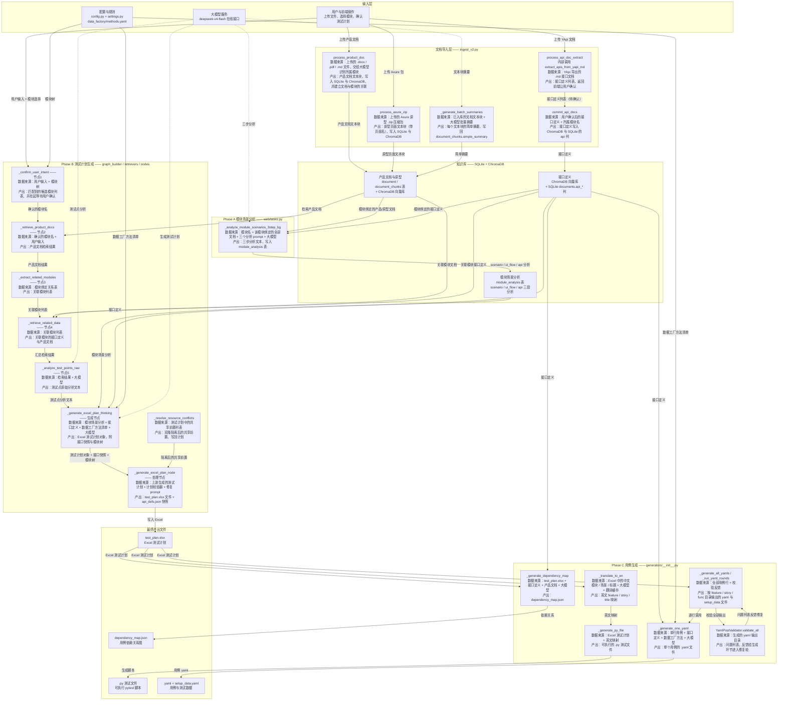

# 方法数据来源与产出总览图（2026-08-04）

> 说明：本图按「输入 → 导入 → 知识库 → 分析 → 生成 → 产出」的流水线组织。
> 每个方法框内标注了它的 **数据来源**（它读什么）和 **产出**（它写出/返回什么）。
> 实线箭头 = 数据流向，虚线箭头 = 大模型调用，带文字箭头 = 具体传递的数据。

```mermaid
flowchart TD
    subgraph L0["输入层"]
        USR["用户与前端操作<br/>上传文件、选择模块、确认测试计划"]
        LLM_SVC["大模型服务<br/>deepseek-v4-flash 在线接口"]
        CFG["配置与规则<br/>config.py + settings.py<br/>data_factory/methods.yaml"]
    end

    subgraph L1["文档导入层 —— ingest_v2.py"]
        M1["process_product_doc<br/>数据来源：上传的 .docx / .pdf / .md 文件，交给大模型识别所属模块<br/>产出：产品文档文本块，写入 SQLite 与 ChromaDB，并建立文档与模块的关联"]
        M2["process_axure_zip<br/>数据来源：上传的 Axure 原型 .zip 压缩包<br/>产出：原型页面文本块（带页面名），写入 SQLite 与 ChromaDB"]
        M3["process_api_doc_extract<br/>内部调用 extract_apis_from_yapi_md<br/>数据来源：YApi 导出的 .md 接口文档<br/>产出：接口定义列表，返回前端让用户确认"]
        M4["commit_api_docs<br/>数据来源：用户确认后的接口定义 + 所属模块名<br/>产出：接口定义写入 ChromaDB 与 SQLite 的 api 列"]
        M5["_generate_batch_summaries<br/>数据来源：已入库的文档文本块 + 大模型批量摘要<br/>产出：每个文本块的简单摘要，写回 document_chunks.simple_summary"]
    end

    subgraph L2["知识库 —— SQLite + ChromaDB"]
        K1["产品文档与原型<br/>document / document_chunks 表<br/>+ ChromaDB 向量库"]
        K2["接口定义<br/>ChromaDB 向量库<br/>+ SQLite documents.api_* 列"]
        K3["模块场景分析<br/>module_analysis 表<br/>scenario / ui_flow / api 三段分析"]
    end

    subgraph L3["Phase A 模块场景分析 —— web/tasks.py"]
        A1["_analyze_module_scenarios_3step_bg<br/>数据来源：模块名 + 该模块绑定的全部文档 + 三个分析 prompt + 大模型<br/>产出：三步分析文本，写入 module_analysis 表"]
    end

    subgraph L4["Phase B 测试计划生成 —— graph_builder / retrievers / nodes"]
        B1["_confirm_user_intent —— 节点1<br/>数据来源：用户输入 + 模块树<br/>产出：匹配到的候选模块列表，并挂起等待用户确认"]
        B2["_retrieve_product_docs —— 节点2<br/>数据来源：确认的模块名 + 用户输入<br/>产出：产品文档检索结果"]
        B3["_extract_related_modules —— 节点3<br/>数据来源：模块绑定关系表<br/>产出：关联模块列表"]
        B4["_retrieve_related_data —— 节点4<br/>数据来源：关联模块列表<br/>产出：关联模块的接口定义与产品文档"]
        B5["_analyze_test_points_raw —— 节点5<br/>数据来源：检索结果 + 大模型<br/>产出：测试点原始分析文本"]
        B6["_generate_excel_plan_thinking —— 生成节点<br/>数据来源：模块场景分析 + 接口定义 + 数据工厂方法清单 + 大模型<br/>产出：Excel 测试计划对象，附接口快照与模块树"]
        B7["_generate_excel_plan_node —— 处理节点<br/>数据来源：上游生成的测试计划 + 计划校验器 + 修复 prompt<br/>产出：test_plan.xlsx 文件 + api_defs.json 快照"]
        B8["_resolve_resource_conflicts<br/>数据来源：测试计划中的共享前置列表<br/>产出：克隆隔离后的共享前置，写回计划"]
    end

    subgraph L5["Phase C 用例生成 —— generators/__init__.py"]
        C1["_generate_dependency_map<br/>数据来源：test_plan.xlsx + 接口定义 + 产品文档 + 大模型<br/>产出：dependency_map.json"]
        C2["_translate_to_en<br/>数据来源：Excel 中的中文模块 / 场景 / 标题 + 大模型 + 翻译缓存<br/>产出：英文 feature / story / title 映射"]
        C3["_generate_py_file<br/>数据来源：Excel 测试计划 + 英文映射<br/>产出：可执行的 .py 测试文件"]
        C4["_generate_one_yaml<br/>数据来源：单行用例 + 接口定义 + 数据工厂方法 + 大模型<br/>产出：单个用例的 .yaml 文件"]
        C5["_generate_all_yamls / _run_yaml_rounds<br/>数据来源：全部用例行 + 校验反馈<br/>产出：按 feature / story / func 目录输出的 yaml 与 setup_data 文件"]
        C6["YamlPostValidator.validate_all<br/>数据来源：生成的 yaml 输出目录<br/>产出：问题列表，反馈给生成环节进入修复轮"]
    end

    subgraph L6["最终产出文件"]
        O1["test_plan.xlsx<br/>Excel 测试计划"]
        O2["dependency_map.json<br/>用例依赖关系图"]
        O3[".py 测试文件<br/>可执行 pytest 脚本"]
        O4[".yaml + setup_data.yaml<br/>用例与测试数据"]
    end

    %% ===== 输入层 → 导入层 =====
    USR -->|上传产品文档| M1
    USR -->|上传 Axure 包| M2
    USR -->|上传 YApi 文档| M3
    LLM_SVC -. 文本块摘要 .-> M5

    %% ===== 导入层 → 知识库 =====
    M1 -->|产品文档文本块| K1
    M2 -->|原型页面文本块| K1
    M5 -->|简单摘要| K1
    M3 -->|接口定义列表（待确认）| M4
    M4 -->|接口定义| K2

    %% ===== 知识库 → Phase A =====
    K1 -->|模块绑定的产品/原型文档| A1
    K2 -->|模块绑定的接口定义| A1
    LLM_SVC -. 三步分析 .-> A1
    A1 -->|scenario / ui_flow / api 分析| K3

    %% ===== Phase B 内部串联 =====
    USR -->|用户输入 + 模块选择| B1
    CFG -->|模块树| B1
    B1 -->|确认的模块名| B2
    K1 -->|检索产品文档| B2
    B2 -->|产品文档结果| B3
    B3 -->|关联模块列表| B4
    K1 -->|关联模块文档| B4
    K2 -->|关联模块接口定义| B4
    B4 -->|汇总检索结果| B5
    LLM_SVC -. 测试点分析 .-> B5
    B5 -->|测试点分析文本| B6
    K3 -->|模块场景分析| B6
    K2 -->|接口定义| B6
    CFG -->|数据工厂方法清单| B6
    LLM_SVC -. 生成测试计划 .-> B6
    B6 -->|测试计划对象 + 接口快照 + 模块树| B7
    B8 -->|隔离后的共享前置| B7
    B7 -->|写入 Excel| O1

    %% ===== Phase C 串联 =====
    O1 -->|Excel 测试计划| C1
    K2 -->|接口定义| C1
    C1 -->|依赖关系| O2
    O1 -->|Excel 测试计划| C2
    C2 -->|英文映射| C3
    C3 -->|生成脚本| O3
    O1 -->|Excel 测试计划| C5
    K2 -->|接口定义| C4
    CFG -->|数据工厂方法清单| C4
    C5 -->|逐行调用| C4
    C4 -->|用例 yaml| O4
    C5 -->|校验全部输出| C6
    C6 -->|问题列表反馈修复| C5
```
