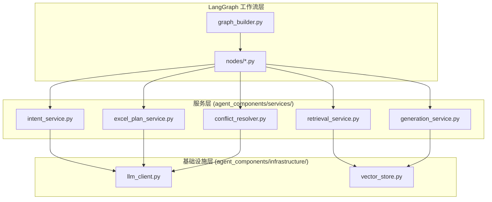

# 架构问题详细修复方案

> 审查日期：2026-07-24
> 审查范围：全项目
> 版本：v1.0

---

## 目录

1. [P0-1: "上帝类"反模式 — ChatTestAgentGraph 拆分](#p0-1-上帝类反模式--chattestagentgraph-拆分)
2. [P0-2: 分布式事务缺失 — SQLite ↔ ChromaDB 一致性保障](#p0-2-分布式事务缺失--sqlite--chromadb-一致性保障)
3. [P0-3: 全局可变状态 — Web 层状态隔离](#p0-3-全局可变状态--web-层状态隔离)
4. [P1-1: 同步/异步分裂 — asyncio.to_thread 桥接优化](#p1-1-同步异步分裂--asyncioto_thread-桥接优化)
5. [P1-2: 状态对象字段膨胀 — State 按阶段拆分](#p1-2-状态对象字段膨胀--state-按阶段拆分)
6. [P1-3: 双重重试机制 — 统一重试框架](#p1-3-双重重试机制--统一重试框架)
7. [P1-4: 配置管理分层混乱 — 统一配置层](#p1-4-配置管理分层混乱--统一配置层)
8. [P2-1: 硬编码平台路径](#p2-1-硬编码平台路径)
9. [P2-2: 大文件模块边界模糊](#p2-2-大文件模块边界模糊)
10. [P2-3: Prompt 缺失版本控制](#p2-3-prompt-缺失版本控制)
11. [P2-4: 无 API 版本化](#p2-4-无-api-版本化)
12. [P2-5: 异常处理不统一](#p2-5-异常处理不统一)

---

## P0-1: "上帝类"反模式 — ChatTestAgentGraph 拆分

### 问题描述

`agent_components/nodes.py` 中的 `ChatTestAgentGraph` 通过多重继承 (`RetrievalMixin`, `GenerationMixin`) 承担了几乎所有业务职责，共 868 行。包含但不限于：

- 意图识别与模块推荐
- Excel 计划生成（含重试循环、质量门禁）
- 资源冲突消解
- LLM 结构化调用封装
- 工作流日志序列化与清理
- 数据工厂方法加载
- Phase B 多跳检索（继承 RetrievalMixin）
- Phase C PY/YAML 生成（继承 GenerationMixin）

### 影响

- 单元测试几乎不可行（无法独立测试单一职责）
- 修改任一节点行为可能影响其他节点
- 新开发者理解成本极高
- 违反单一职责原则 (SRP)

### 目标架构



### 修复步骤

#### Step 1: 提取 LLM 客户端为独立基础设施组件

```python
# 新文件: agent_components/infrastructure/llm_client.py

"""LLM 客户端 — 全局单例 + 结构化输出调用。

职责: LLM 实例创建、配置、结构化输出调用、重试。
不含任何业务逻辑。
"""

import threading
from typing import Optional, Type

from pydantic import BaseModel

import config
from observability import get_logger
from agent_components.llm.deepseek import DeepSeekChatOpenAI

logger = get_logger(__name__)

_llm_instance: Optional[DeepSeekChatOpenAI] = None
_llm_lock = threading.Lock()


def reload_llm():
    """重置 LLM 单例，下次 get_llm() 调用时使用最新配置重建（支持热重载）。"""
    global _llm_instance
    with _llm_lock:
        _llm_instance = None


def get_llm() -> DeepSeekChatOpenAI:
    """获取 LLM 客户端单例（双检锁，线程安全）。"""
    global _llm_instance
    if _llm_instance is None:
        with _llm_lock:
            if _llm_instance is None:
                _llm_instance = DeepSeekChatOpenAI(
                    model=config.LLM_MODEL,
                    base_url=config.LLM_BASE_URL,
                    api_key=config.LLM_API_KEY(),
                    temperature=config.LLM_TEMPERATURE,
                    max_tokens=16384,
                )
    return _llm_instance


# 方法特性配置表（声明式，集中管理 method 与 thinking 的兼容性）
METHOD_FEATURES = {
    "function_calling": {"supports_thinking": False},
    "json_mode": {"supports_thinking": False},
    "json_schema": {"supports_thinking": False},
    "free_text": {"supports_thinking": True},
}


class StructuredOutputClient:
    """LLM 结构化输出调用封装。

    使用方法:
        client = StructuredOutputClient()
        result = client.invoke(prompt, MyModel, method="json_mode", var1="val1")
    """

    def __init__(self, llm: DeepSeekChatOpenAI = None):
        self.llm = llm or get_llm()

    def invoke(
        self,
        prompt,
        model_class: Type[BaseModel],
        max_retries: int = config.MAX_RETRIES,
        method: str = "function_calling",
        thinking: bool = False,
        temperature: float | None = None,
        log_label: str = "",
        **kwargs,
    ) -> BaseModel:
        """调用 LLM 并校验结构化输出，失败时自动重试。"""
        features = METHOD_FEATURES.get(method)
        llm_kwargs = {}
        if features is None:
            logger.warning("未知 method '%s'，使用保守配置（禁用 thinking）", method)
            llm_kwargs["extra_body"] = {"thinking": {"type": "disabled"}}
        elif not features["supports_thinking"]:
            if thinking:
                logger.warning("%s 不支持 thinking=True，已自动禁用 thinking", method)
            llm_kwargs["extra_body"] = {"thinking": {"type": "disabled"}}
        elif thinking and config.ENABLE_THINKING:
            llm_kwargs["extra_body"] = {"thinking": {"type": "enabled"}}

        _llm = self.llm.bind(temperature=temperature) if temperature is not None else self.llm
        chain = prompt | _llm.with_structured_output(
            model_class, method=method, **llm_kwargs
        )

        last_error = None
        for attempt in range(1 + max_retries):
            try:
                result = chain.invoke(kwargs)
                if result is None:
                    raise ValueError("LLM 返回了空结果（None）")
                if log_label:
                    from observability import log_thinking
                    import json as _json
                    _raw = result.model_dump() if hasattr(result, "model_dump") else str(result)
                    log_thinking(log_label, "", _json.dumps(_raw, indent=2, ensure_ascii=False)[:8000],
                                 prompt_label=log_label)
                if isinstance(result, dict):
                    result = model_class(**result)
                return result
            except Exception as e:
                last_error = e
                if attempt < max_retries:
                    logger.warning("输出校验失败，第 %d 次重试 (%s): %s",
                                   attempt + 1, type(e).__name__, e, exc_info=True)

        raise RuntimeError(
            f"LLM 结构化输出校验失败（本调用内重试 {max_retries} 次）: {last_error}"
        )
```

#### Step 2: 提取资源冲突消解器

```python
# 新文件: agent_components/services/conflict_resolver.py

"""资源冲突消解服务。

纯代码节点，不调用 LLM。
检测同一 PRE（共享前置条件）被多个正向写操作用例引用时，克隆隔离。
"""

from collections import defaultdict

import config
from observability import get_logger
from prompts.response_model import ExcelPlanV2, SharedPrecondition

logger = get_logger(__name__)


class ConflictResolver:
    """Phase B 资源冲突消解器。

    算法:
      1. 关键词兜底 LLM 漏标（mutates_data 未标但 steps 含写操作关键词）
      2. 构建 PRE → 正向写操作用例列表
      3. 同一 PRE 被 ≥2 个正向写操作用例引用 → 克隆隔离
    """

    def resolve(
        self,
        plan: ExcelPlanV2,
        shared_pres: list[SharedPrecondition] | None = None,
    ) -> int:
        """执行冲突消解，返回隔离的 PRE 数量。"""
        if not plan or not plan.test_cases:
            return 0

        # 1. 代码兜底 LLM 漏标
        self._backfill_mutates_data(plan)

        # 2. 构建 PRE → 正向写操作用例列表
        pre_refs = self._build_pre_refs(plan)

        # 3. 检测冲突 → 克隆隔离
        return self._isolate_conflicts(plan, pre_refs, shared_pres)

    def _backfill_mutates_data(self, plan: ExcelPlanV2) -> None:
        """关键词兜底 LLM 漏标的 mutates_data 标记。"""
        for tc in plan.test_cases:
            if tc.preconditions and not tc.mutates_data:
                if any(kw in tc.steps for kw in config.RESOURCE_MUTATE_KEYWORDS):
                    tc.mutates_data = True
                    logger.debug("消解器兜底: %s 未标 mutates_data，已自动标记", tc.id)

    def _build_pre_refs(self, plan: ExcelPlanV2) -> dict[str, list]:
        """构建 PRE ID → 引用该 PRE 的正向写操作用例列表。"""
        pre_refs: dict[str, list] = defaultdict(list)
        for tc in plan.test_cases:
            if not tc.mutates_data or tc.is_negative_test:
                continue
            for pid in tc.preconditions:
                pre_refs[pid].append(tc)
        return pre_refs

    def _isolate_conflicts(
        self,
        plan: ExcelPlanV2,
        pre_refs: dict[str, list],
        shared_pres: list[SharedPrecondition] | None = None,
    ) -> int:
        """为冲突的 PRE 创建隔离副本。"""
        isolation_count = 0
        _pre_list = shared_pres if shared_pres else plan.shared_preconditions

        for pre_id, ref_list in pre_refs.items():
            if len(ref_list) <= 1:
                continue

            original = next((p for p in _pre_list if p.id == pre_id), None)
            if original is None:
                logger.warning(
                    "消解器: PRE %s 被 %d 个用例引用但未在 shared_preconditions 中找到",
                    pre_id, len(ref_list),
                )
                continue

            # 第一个用例保持引用原始 PRE，其余克隆隔离
            for tc in ref_list[1:]:
                clone_id = f"{pre_id}_isolated_{tc.id}"
                _pre_list.append(SharedPrecondition(
                    id=clone_id,
                    name=f"{original.name}（{tc.id}专用）",
                    steps=original.steps,
                    expected=original.expected,
                    cloned_from=pre_id,
                ))
                tc.preconditions = [
                    clone_id if p == pre_id else p for p in tc.preconditions
                ]
                isolation_count += 1
                logger.info("消解器: %s → %s（%s 隔离）", pre_id, clone_id, tc.id)

        if isolation_count:
            logger.info("消解器完成: %d 个 PRE 被隔离，共 %d 条用例受影响",
                        len([p for p, r in pre_refs.items() if len(r) > 1]),
                        isolation_count)
        return isolation_count
```

#### Step 3: 提取 Excel 计划生成服务

```python
# 新文件: agent_components/services/excel_plan_service.py

"""Excel 测试计划生成服务。

职责:
  - LLM 调用生成 ExcelPlanV2
  - 输出校验（必填字段、步骤/预期对齐、前置引用完整性）
  - 质量门禁（通过率 < 50% 触发全量重生成）
  - 逐行修复循环
  - 写入双 Sheet Excel 文件
  - 接口定义快照落盘
"""

import json
import os
from datetime import datetime
from typing import Optional

from openpyxl import Workbook
from openpyxl.styles import Font, Alignment, PatternFill, Border, Side
from openpyxl.utils import get_column_letter

import config
from observability import get_logger
from prompts.response_model import (
    ApiDefinition, ExcelPlanV2, ProperResponse, SharedPrecondition, TestCaseRow,
)
from prompts.definitions import PromptFactory

logger = get_logger(__name__)


class ExcelPlanGenerationError(RuntimeError):
    """Excel 计划生成失败。"""
    pass


class QualityGateFailure(ExcelPlanGenerationError):
    """质量门禁不通过（连续多次全量生成通过率 < 50%）。"""
    pass


class ExcelPlanService:
    """Excel 测试计划生成服务。

    Args:
        llm_client: StructuredOutputClient 实例
        prompt_factory: PromptFactory 实例
        conflict_resolver: ConflictResolver 实例
    """

    def __init__(self, llm_client, prompt_factory, conflict_resolver):
        self.llm_client = llm_client
        self.prompt_factory = prompt_factory
        self.conflict_resolver = conflict_resolver

    def generate(
        self,
        state: dict,
        module_tree: list[dict],
        all_apis_dict: list[dict],
        test_analysis: str,
        output_dir: str = None,
    ) -> dict:
        """生成 Excel 测试计划并返回状态更新字典。

        Returns:
            {"excel_plan": ..., "excel_path": ..., "output_dir": ..., "response_obj": ...}
        """
        prompt = self.prompt_factory.generate_excel_plan_node()
        api_list = [
            ApiDefinition(
                name=d.get("name", "?"), url=d.get("url", ""),
                method=d.get("method", "GET"), description=d.get("description", ""),
                parameters=d.get("parameters", {}), returns=d.get("returns", {}),
            )
            for d in (state.get("api_definitions") or [])
        ]
        all_apis_json = json.dumps([a.model_dump() for a in api_list], indent=2, ensure_ascii=False)
        module_tree_json = json.dumps(module_tree, indent=2, ensure_ascii=False)

        _sections = self._split_thinking_sections(test_analysis)
        prompt_vars = {
            "module_tree": module_tree_json,
            "analysis_section": _sections["analysis"],
            "shared_pre_section": _sections["preconditions"],
            "cases_section": _sections["cases"],
            "all_apis_info": all_apis_json,
            "user_context": state["original_input"],
        }

        # 全量生成 + 质量门禁 + 修复循环
        all_confirmed, all_shared_pres, failed_details = self._generate_with_repair(
            prompt, prompt_vars, _sections,
        )

        if not all_confirmed:
            return {
                "excel_plan": None, "excel_path": "",
                "output_dir": output_dir,
                "error_info": ["所有行均未通过校验"],
                "response_obj": ProperResponse(
                    proper_thinking=[], worth_to_remember=False,
                    final_response="Excel 测试计划生成失败：所有用例均未通过校验，请重试",
                ),
            }

        # 确定输出目录
        output_dir = self._resolve_output_dir(
            state.get("confirmed_module"), module_tree,
            all_confirmed, output_dir,
        )

        # 写入 Excel 文件
        excel_path = self._write_excel(
            output_dir, all_confirmed, all_shared_pres,
            state.get("confirmed_module") or "",
        )

        # 接口定义快照落盘（M8 规则）
        self._save_api_snapshot(output_dir, all_apis_dict)

        fail_warn = f"（{len(failed_details)} 行未通过校验）" if failed_details else ""
        n_confirmed = len(all_confirmed)
        return {
            "excel_plan": ExcelPlanV2(
                shared_preconditions=all_shared_pres,
                test_cases=all_confirmed,
            ),
            "excel_path": excel_path,
            "output_dir": output_dir,
            "response_obj": ProperResponse(
                proper_thinking=[f"已分析 {n_confirmed} 条用例"],
                final_response=f"Excel 测试计划已生成：共 {n_confirmed} 条用例{fail_warn}",
                worth_to_remember=False,
            ),
        }

    # --- 内部方法（从 nodes.py 迁移） ---

    def _generate_with_repair(self, prompt, prompt_vars, sections) -> tuple:
        """全量生成 + 质量门禁 + 重试修复循环。"""
        # 迁移原有 _generate_excel_plan_node 中的核心循环逻辑
        # （为控制篇幅，此处只展示接口，完整实现从 nodes.py 搬移）
        raise NotImplementedError("从 nodes.py 迁移 _generate_excel_plan_node 循环逻辑")

    def _write_excel(self, output_dir, valid_cases, shared_pres, project_name) -> str:
        """写入双 Sheet Excel 文件。"""
        # 迁移原有的 Excel 写入逻辑（nodes.py 第 427-489 行）
        raise NotImplementedError("从 nodes.py 迁移 Excel 写入逻辑")

    def _resolve_output_dir(self, module_name, tree, cases, base_dir) -> str:
        """解析输出目录路径。"""
        raise NotImplementedError("从 nodes.py 迁移路径解析逻辑")

    def _save_api_snapshot(self, output_dir, api_dicts) -> None:
        """保存接口定义快照到 api_defs.json。"""
        path = os.path.join(output_dir, "api_defs.json")
        with open(path, "w", encoding="utf-8") as f:
            json.dump(api_dicts, f, ensure_ascii=False, indent=2)
        logger.info("接口定义快照已保存: %s (%d 个接口)", path, len(api_dicts))

    @staticmethod
    def _split_thinking_sections(text: str) -> dict:
        """将 thinking 分析输出按三个段落拆分为独立输入。"""
        markers = [
            ("## 测试场景分析", "analysis"),
            ("## 共享前置", "preconditions"),
            ("## 测试用例", "cases"),
        ]
        result = {"analysis": "（无）", "preconditions": "（无）", "cases": "（无）"}
        for i, (marker, key) in enumerate(markers):
            if marker not in text:
                continue
            parts = text.split(marker, 1)
            if len(parts) < 2:
                continue
            rest = parts[1]
            end = len(rest)
            for j in range(i + 1, len(markers)):
                pos = rest.find(markers[j][0])
                if pos != -1 and pos < end:
                    end = pos
            result[key] = marker + "\n" + rest[:end].strip()
        return result
```

#### Step 4: 简化 ChatTestAgentGraph 为编排器

```python
# agent_components/nodes.py 改造后

"""LangGraph 节点编排层。

每个节点方法委托给对应的 service 层，ChatTestAgentGraph 只做编排，
不再包含业务逻辑。
"""

from agent_components.infrastructure.llm_client import StructuredOutputClient, get_llm
from agent_components.services.conflict_resolver import ConflictResolver
from agent_components.services.excel_plan_service import ExcelPlanService
# ... 其他 service import


class ChatTestAgentGraph:
    """智能测试助手 — LangGraph 节点编排器。

    仅做节点路由编排，业务逻辑全部分发到 service 层。
    """

    def __init__(self):
        llm = get_llm()
        self.llm_client = StructuredOutputClient(llm)
        self.prompt_factory = PromptFactory()
        self.dual_chroma = get_chroma_db()

        # 子服务
        self.intent_service = IntentService(self.llm_client, self.prompt_factory)
        self.retrieval_service = RetrievalService(self.dual_chroma)
        self.excel_plan_service = ExcelPlanService(
            self.llm_client, self.prompt_factory, ConflictResolver(),
        )
        self.generation_service = GenerationService(self.llm_client)

        # 工作流日志（保留，后续可提取为 WorkflowLogger service）
        self._run_data: dict = {}
        self._run_timestamp: Optional[str] = None

    # 节点方法 — 委托给 service
    def _confirm_user_intent(self, state): ...
    def _retrieve_product_docs(self, state): ...
    def _extract_related_modules(self, state): ...
    def _generate_excel_plan_node(self, state): ...
```

#### Step 5: 迁移日志辅助方法到独立日志服务

```python
# 新文件: agent_components/services/workflow_logger.py

"""工作流日志服务。

职责:
  - 节点产出物累积到同一份运行日志
  - JSON + Markdown 双格式
  - 自动清理旧日志（保留 ≤15 组）
"""

import json
import os
from datetime import datetime
from pathlib import Path

from pydantic import BaseModel
from observability import get_logger

logger = get_logger(__name__)

LOG_DIR = Path("logs") / "workflow"
MAX_LOG_PAIRS = 15


class WorkflowLogger:
    """一次工作流运行的日志累积器。"""

    def __init__(self):
        self._run_data: dict = {}
        self._run_timestamp: Optional[str] = None

    def log_node(self, node_name: str, output: dict) -> None:
        """记录一个节点的产出物。"""
        LOG_DIR.mkdir(parents=True, exist_ok=True)

        if self._run_timestamp is None:
            self._run_timestamp = datetime.now().strftime("%Y%m%d_%H%M%S")

        self._run_data[node_name] = self._serialize(output)

        base_name = f"workflow_{self._run_timestamp}"
        self._write_json(LOG_DIR / f"{base_name}.json")
        self._write_md(LOG_DIR / f"{base_name}.md")
        self._cleanup_old_logs()

    # ... (其余实现从 nodes.py 搬移)
```

### 文件变更清单

| 操作 | 文件 | 说明 |
|------|------|------|
| 新建 | `agent_components/infrastructure/__init__.py` | 基础设施包 |
| 新建 | `agent_components/infrastructure/llm_client.py` | LLM 客户端封装 |
| 新建 | `agent_components/services/__init__.py` | 服务包 |
| 新建 | `agent_components/services/intent_service.py` | 意图识别 |
| 新建 | `agent_components/services/retrieval_service.py` | 多跳检索 |
| 新建 | `agent_components/services/excel_plan_service.py` | Excel 生成 |
| 新建 | `agent_components/services/conflict_resolver.py` | 冲突消解 |
| 新建 | `agent_components/services/generation_service.py` | PY/YAML 生成 |
| 新建 | `agent_components/services/workflow_logger.py` | 日志服务 |
| 修改 | `agent_components/nodes.py` | 简化为编排层 |
| 修改 | `agent_components/graph_builder.py` | 适配新结构 |
| 修改 | `web/app.py` | 更新 import 路径 |
| 修改 | `web/tasks.py` | 更新 import 路径 |

---

## P0-2: 分布式事务缺失 — SQLite ↔ ChromaDB 一致性保障

### 问题描述

当前删除文档时，SQLite 和 ChromaDB 的清理操作之间没有事务协调：

1. SQLite：删除 documents 表记录 + bindings 级联清理 (`database/operations.py:86`)
2. ChromaDB：清理向量 (`agent_components/dual_chroma.py:117-123`)
3. 磁盘文件：删除上传文件

如果第1步成功但第2步失败（ChromaDB 不可用），系统进入不一致状态——SQLite 已无记录，但 ChromaDB 仍保留僵尸向量，污染检索结果。

### 影响

- 检索结果可能返回已删除文档的内容
- 累积僵尸数据影响检索质量
- 当前仅靠日志警告，无自动恢复

### 目标架构

```
删除请求
    │
    ▼
┌─────────────────────────────┐
│   DocumentDeletionSaga      │
│                             │
│  1. 标记 SQLite status=     │
│     "deleting"              │
│         │                   │
│         ▼ 成功              │
│  2. 删除 ChromaDB 向量      │──失败──▶ 恢复 status="ready"
│         │                             (补偿)
│         ▼ 成功              │
│  3. 删除磁盘文件             │──失败──▶ 记录到 _deletion_retry_queue
│         │                             (后台重试)
│         ▼ 成功              │
│  4. 删除 SQLite 记录         │──失败──▶ 触发人工干预告警
│         │                   │
│         ▼                   │
│  5. status="deleted" ✓     │
└─────────────────────────────┘
```

### 修复步骤

#### Step 1: 新增文档状态枚举

```python
# 在 database/models.py Document 类中增加状态值

# 当前使用: pending / bound
# 扩展为: pending / bound / deleting / deleted

# 同时在 documents 表增加 deleted_at 字段（软删除支持）
```

#### Step 2: 实现 Saga 删除编排器

```python
# 新文件: agent_components/services/document_lifecycle.py

"""文档生命周期管理 — Saga 模式保障 SQLite ↔ ChromaDB ↔ 磁盘一致性。"""

import os
import time
from datetime import datetime, timezone
from typing import Optional

from database import get_session_ctx
from database.operations import DocOps, BindingOps
from agent_components.dual_chroma import get_chroma_db
from observability import get_logger

logger = get_logger(__name__)


class DocumentDeletionSaga:
    """Saga 模式文档删除编排器。

    步骤顺序:
      1. SQLite 标记 "deleting"
      2. ChromaDB 清理向量（重点保护步骤）
      3. 磁盘清理
      4. SQLite 物理删除
    任一步骤失败 → 执行对应补偿操作。
    """

    MAX_CHROMA_RETRIES = 3
    CHROMA_RETRY_DELAY = 2  # 秒

    def __init__(self, chroma=None):
        self.chroma = chroma or get_chroma_db()

    def execute(self, doc_id: str, file_paths: list[str] | None = None) -> bool:
        """执行完整的文档删除 Saga。

        Args:
            doc_id: 文档 ID
            file_paths: 关联的磁盘文件路径列表（可选）

        Returns:
            True: 完全成功
            False: 部分失败（系统保持最终一致，失败步骤记录供后台补偿）

        Raises:
            ValueError: doc_id 不存在
        """
        with get_session_ctx() as session:
            doc = DocOps.get_document(session, doc_id)
            if not doc:
                raise ValueError(f"文档不存在: {doc_id}")

            # === Step 1: 标记为 deleting ===
            DocOps.update_document(session, doc_id, status="deleting")
            session.commit()
            logger.info("Saga[%s]: Step1 标记 deleting ✓", doc_id)

            # === Step 2: ChromaDB 清理（带重试） ===
            chroma_ok = self._step_delete_chroma(doc_id)
            if not chroma_ok:
                # 补偿 Step 1
                DocOps.update_document(session, doc_id, status="ready")
                session.commit()
                logger.error("Saga[%s]: ChromaDB 清理失败，已回滚 status → ready", doc_id)
                return False

            # === Step 3: 磁盘清理 ===
            disk_ok = self._step_delete_files(file_paths or [])
            if not disk_ok:
                # ChromaDB 已删，磁盘清理失败不阻塞（后台重试）
                self._schedule_disk_retry(doc_id, file_paths)
                logger.warning("Saga[%s]: 磁盘清理失败，已加入后台重试队列", doc_id)

            # === Step 4: SQLite 物理删除 ===
            try:
                DocOps.delete_document(session, doc_id)
                session.commit()
                logger.info("Saga[%s]: 全部删除完成 ✓", doc_id)
                return True
            except Exception as e:
                # 此时 ChromaDB 已清理但 SQLite 删除失败
                # 标记为 deleted_at 时间戳（软删除），避免重复执行
                DocOps.update_document(
                    session, doc_id,
                    status="deleted",
                    # deleted_at=datetime.now(timezone.utc),  # 需要新增字段
                )
                session.commit()
                logger.critical(
                    "Saga[%s]: SQLite 物理删除失败（ChromaDB 已清理），"
                    "已标记软删除。需人工确认: %s", doc_id, e, exc_info=True,
                )
                return False

    def _step_delete_chroma(self, doc_id: str) -> bool:
        """Step 2: 删除 ChromaDB 向量（带重试）。"""
        for attempt in range(1, self.MAX_CHROMA_RETRIES + 1):
            try:
                self.chroma.delete_by_doc_id(doc_id)
                logger.info("Saga[%s]: ChromaDB 清理成功 (attempt %d)", doc_id, attempt)
                return True
            except Exception as e:
                logger.warning(
                    "Saga[%s]: ChromaDB 清理失败 attempt %d/%d: %s",
                    doc_id, attempt, self.MAX_CHROMA_RETRIES, e,
                )
                if attempt < self.MAX_CHROMA_RETRIES:
                    time.sleep(self.CHROMA_RETRY_DELAY)
        return False

    def _step_delete_files(self, file_paths: list[str]) -> bool:
        """Step 3: 删除磁盘文件。"""
        all_ok = True
        for path in file_paths:
            try:
                if os.path.isfile(path):
                    os.remove(path)
                # 同时清理 .meta.json
                meta_path = path + ".meta.json"
                if os.path.isfile(meta_path):
                    os.remove(meta_path)
            except OSError as e:
                logger.warning("Saga: 文件删除失败 %s: %s", path, e)
                all_ok = False
        return all_ok

    def _schedule_disk_retry(self, doc_id: str, file_paths: list[str]) -> None:
        """将磁盘清理失败项写入持久化重试队列。"""
        # 写入 retry_queue.json（或 SQLite 表），由后台定时任务消费
        retry_file = os.path.join("logs", "_deletion_retry_queue.json")
        # ...


class DeletionRetryWorker:
    """后台定时任务：重试失败的磁盘清理和 ChromaDB 同步。

    每 5 分钟扫描一次 retry_queue，对每项执行清理。
    超过 24 小时的失败项记录到告警日志。
    """

    async def run_periodic(self):
        """FastAPI lifespan 后台任务入口。"""
        while True:
            try:
                await self._process_retry_queue()
            except Exception:
                logger.warning("重试队列处理异常", exc_info=True)
            await asyncio.sleep(300)  # 5 分钟

    async def _process_retry_queue(self) -> None:
        """处理重试队列中的一项。"""
        # 读取 retry_queue.json → 逐项重试 → 成功的移除
        pass


def delete_document_safe(doc_id: str, file_paths: list[str] = None) -> dict:
    """对外暴露的安全删除接口。

    Returns:
        {"success": bool, "message": str, "needs_manual_review": bool}
    """
    saga = DocumentDeletionSaga()
    try:
        ok = saga.execute(doc_id, file_paths)
        if ok:
            return {"success": True, "message": "删除成功", "needs_manual_review": False}
        else:
            return {
                "success": False,
                "message": "部分清理失败。向量已清除，磁盘文件将在后台重试。",
                "needs_manual_review": True,
            }
    except ValueError as e:
        return {"success": False, "message": str(e), "needs_manual_review": False}
```

#### Step 3: 修改现有删除入口

```python
# web/routes/files.py — 删除端点改为使用 Saga

# 旧代码:
# DocOps.delete_document(session, doc_id)
# chroma.delete_by_doc_id(doc_id)

# 新代码:
from agent_components.services.document_lifecycle import delete_document_safe

result = delete_document_safe(doc_id, file_paths=[...])
if result["needs_manual_review"]:
    logger.warning("文档 %s 删除需关注: %s", doc_id, result["message"])
```

### 文件变更清单

| 操作 | 文件 | 说明 |
|------|------|------|
| 新建 | `agent_components/services/document_lifecycle.py` | Saga + 后台重试 |
| 修改 | `database/models.py` | 增加 deleted_at 字段、状态枚举扩展 |
| 修改 | `web/routes/files.py` | 删除端点改为 Saga |
| 修改 | `web/app.py` | lifespan 启动 DeletionRetryWorker |
| 可选 | `database/operations.py` | 增加 mark_deleted / mark_status 方法 |

---

## P0-3: 全局可变状态 — Web 层状态隔离

### 问题描述

`web/app.py` 中大量使用模块级全局变量管理运行时状态：

```python
_phase_b_graph = None          # 全局图实例
_phase_b_components = None     # 全局组件实例（ChatTestAgentGraph 含可变实例属性）
_chroma_db = None              # 全局向量库
_vector_ready = False          # 全局向量就绪标记
_imported_files: dict = {}     # 内存文件缓存
_task_store: dict = {}         # 任务状态
_workflow_sessions: dict = {}  # 会话状态
```

### 影响

- `_phase_b_components._run_data` 等实例属性在并发请求中可能被覆盖
- `_vector_ready` 无法区分不同用户的数据就绪状态
- 重启后非默认用户的内存文件列表丢失
- 单元测试无法独立运行（依赖全局状态）

### 目标架构

```python
# 从模块级全局变量 → 单例 AppContext 对象

class AppContext:
    """应用全局上下文 — 集中管理所有运行时状态。

    生命周期: lifespan 中初始化，请求通过 FastAPI Depends 注入。
    """

    def __init__(self):
        # 基础设施（启动时创建，运行期间不变）
        self.chroma_db: DualChromaDB = None
        self.phase_b_graph: StateGraph = None
        self.phase_b_components: ChatTestAgentGraph = None

        # 运行时状态（线程安全容器）
        self._task_store: dict = {}
        self._task_lock = asyncio.Lock()
        self._workflow_sessions: dict = {}
        self._sessions_lock = asyncio.Lock()

        # 启动标记
        self.vector_ready: bool = False

    # 文件列表完全依赖 SQLite 查询（去掉内存缓存）
    async def get_imported_files(self, user_id: str = "default") -> list[dict]:
        """从 SQLite 实时查询文件列表（单一事实源）。"""
        with get_session_ctx() as session:
            return [self._doc_to_file_info(d) for d in DocOps.get_all_documents(session)]

    async def create_task(self) -> str: ...
    async def update_task(self, task_id: str, **kwargs): ...
    async def get_task(self, task_id: str) -> dict: ...


# 全局单例（只创建一次）
_app_context: Optional[AppContext] = None


def get_app_context() -> AppContext:
    """获取全局 AppContext 单例。"""
    global _app_context
    if _app_context is None:
        _app_context = AppContext()
    return _app_context


# FastAPI 依赖注入
async def get_context() -> AppContext:
    return get_app_context()


# 路由中使用
@app.post("/api/chat")
async def chat(ctx: AppContext = Depends(get_context)):
    ...
```

### 修复步骤

#### Step 1: 创建 AppContext 类

```python
# 新文件: web/context.py

"""Web 层应用上下文 — 集中管理全局状态。

替代 web/app.py 中的模块级可变变量。
所有运行时状态通过此对象访问，支持并发安全。
"""

import asyncio
import time
import uuid
from datetime import datetime
from typing import Optional

from fastapi import Depends

from database import get_session_ctx
from database.operations import DocOps


class AppContext:
    """应用全局上下文。

    线程安全：所有可变状态通过 asyncio.Lock 保护。
    单例模式：lifespan 中初始化，全应用共享。
    """

    def __init__(self):
        # ── 基础设施（lifespan 中赋值） ──
        self.chroma_db = None
        self.phase_b_graph = None
        self.phase_b_components = None

        # ── 运行时状态 ──
        self._task_store: dict = {}
        self._task_lock = asyncio.Lock()

        self._workflow_sessions: dict = {}
        self._sessions_lock = asyncio.Lock()

        # ── 就绪标记 ──
        self.vector_ready: bool = False

    # ===== 文件列表（SQLite 唯一事实源） =====

    async def get_imported_files(self, user_id: str = "default") -> list[dict]:
        """从 SQLite 实时查询已导入文件列表。"""
        from database import get_session_ctx
        from database.operations import DocOps
        from pathlib import Path
        import config

        with get_session_ctx() as session:
            docs = DocOps.get_all_documents(session)
            result = []
            for d in docs:
                size_str = "—"
                for scan_dir in ["uploads/pdf", "uploads/docx", "uploads/product",
                                "uploads/axure", "uploads/md"]:
                    candidate = Path(config.BASE_DIR) / scan_dir / d.file_name
                    if candidate.is_file():
                        size_str = f"{candidate.stat().st_size / 1024:.1f} KB"
                        break
                result.append({
                    "name": d.file_name,
                    "type": d.doc_type,
                    "chunks": d.chunk_count or "—",
                    "time": d.upload_time.strftime("%Y-%m-%d %H:%M:%S")
                    if d.upload_time else "—",
                    "doc_id": d.id,
                    "status": d.status or "",
                    "size": size_str,
                })
            return result

    # ===== 任务管理 =====

    async def create_task(self) -> str:
        """创建任务并返回 task_id。同时清理过期任务。"""
        import config
        now = datetime.now()
        ttl = config.TASK_TTL_SECONDS
        task_id = uuid.uuid4().hex
        async with self._task_lock:
            # 清理过期任务
            expired = []
            for tid, t in self._task_store.items():
                try:
                    created = datetime.fromisoformat(t.get("created_at", ""))
                    if (now - created).total_seconds() > ttl:
                        expired.append(tid)
                except (ValueError, TypeError):
                    expired.append(tid)
            for tid in expired:
                del self._task_store[tid]
            # 创建新任务
            self._task_store[task_id] = {
                "status": "pending",
                "progress": 0,
                "message": "任务已提交",
                "result": None,
                "error": None,
                "created_at": now.isoformat(),
            }
        return task_id

    async def update_task(self, task_id: str, **kwargs):
        """更新任务状态。"""
        async with self._task_lock:
            if task_id in self._task_store:
                self._task_store[task_id].update(kwargs)

    async def get_task(self, task_id: str) -> Optional[dict]:
        """查询任务状态。"""
        async with self._task_lock:
            return self._task_store.get(task_id)

    # ===== 工作流会话 =====

    async def get_session(self, session_id: str) -> Optional[dict]:
        """获取工作流会话（顺带清理过期会话）。"""
        import config
        now = time.time()
        ttl = config.WORKFLOW_SESSION_TTL
        async with self._sessions_lock:
            # 清理过期
            expired = [
                sid for sid, s in self._workflow_sessions.items()
                if now - s.get("created_at", 0) > ttl
            ]
            for sid in expired:
                del self._workflow_sessions[sid]
            return self._workflow_sessions.get(session_id)

    async def create_session(self, session_id: str, user_id: str = "default") -> dict:
        """创建工作流会话。"""
        async with self._sessions_lock:
            self._workflow_sessions[session_id] = {
                "state": None,
                "created_at": time.time(),
                "user_id": user_id,
            }
            return self._workflow_sessions[session_id]

    async def update_session_state(self, session_id: str, state: dict):
        """更新会话状态。"""
        async with self._sessions_lock:
            if session_id in self._workflow_sessions:
                self._workflow_sessions[session_id]["state"] = state

    async def delete_session(self, session_id: str):
        """删除会话。"""
        async with self._sessions_lock:
            self._workflow_sessions.pop(session_id, None)


# ── 全局单例 ──

_app_ctx: Optional[AppContext] = None


def init_app_context() -> AppContext:
    """创建并返回全局 AppContext 单例。"""
    global _app_ctx
    if _app_ctx is None:
        _app_ctx = AppContext()
    return _app_ctx


def get_app_context() -> AppContext:
    """获取全局 AppContext（FastAPI Depends 用）。"""
    if _app_ctx is None:
        raise RuntimeError("AppContext 未初始化，请检查 lifespan 配置")
    return _app_ctx
```

#### Step 2: 修改 web/app.py lifespan

```python
# web/app.py 改造关键片段

from web.context import init_app_context, get_app_context

@asynccontextmanager
async def lifespan(app: FastAPI):
    """应用生命周期。"""
    ctx = init_app_context()

    # ... 初始化 ChromaDB, LLM 等 ...

    # 注入到 AppContext
    ctx.chroma_db = _chroma_db  # 或直接通过 get_chroma_db() 懒加载
    ctx.phase_b_graph, ctx.phase_b_components = build_workflow()
    ctx.vector_ready = _check_vector_ready()

    # 启动后台任务
    cleanup_task = asyncio.create_task(_cleanup_temp_files_loop())

    yield  # 应用运行中

    # shutdown
    cleanup_task.cancel()
```

#### Step 3: 修改路由使用 Depends 注入

```python
# web/routes/chat.py 示例

from web.context import get_app_context, AppContext

@router.post("/phase-b/confirm")
async def phase_b_confirm(
    data: dict,
    ctx: AppContext = Depends(get_app_context),
):
    """Phase B 用户确认模块。"""
    task_id = await ctx.create_task()
    session_id = data.get("session_id")
    # ...
    # 使用 ctx.phase_b_components 而非全局变量
    # 使用 await ctx.update_task(...) 而非全局函数
```

### 文件变更清单

| 操作 | 文件 | 说明 |
|------|------|------|
| 新建 | `web/context.py` | AppContext 类 + 依赖注入 |
| 修改 | `web/app.py` | 移除全局变量，改用 AppContext |
| 修改 | `web/routes/chat.py` | 注入 ctx |
| 修改 | `web/routes/files.py` | 注入 ctx |
| 修改 | `web/routes/api_extract.py` | 注入 ctx |
| 修改 | `web/tasks.py` | 注入 ctx，使用 ctx.update_task |

---

## P1-1: 同步/异步分裂 — asyncio.to_thread 桥接优化

### 问题描述

所有 LLM 调用、ChromaDB 检索、文件 I/O 都是同步阻塞的。Web 层被迫使用 `asyncio.to_thread()` 将阻塞操作卸载到线程池。

```python
# web/tasks.py 典型调用
py_result = await asyncio.to_thread(
    _phase_b_components._generate_py_file, excel_path,
)
yaml_result = await asyncio.to_thread(
    _phase_b_components._generate_all_yamls,
    excel_path, api_defs_json, user_ctx,
)
```

### 影响

- 线程池耗尽时新请求阻塞
- CancellationToken 无法优雅传递到同步代码
- 心跳需要额外 asyncio task

### 目标架构

```
当前（全同步）:
  FastAPI async handler
    → asyncio.to_thread()
      → 同步 LLM 调用（阻塞线程池线程）
      → 同步 ChromaDB（阻塞线程池线程）

目标（渐进式异步）:
  FastAPI async handler
    → 异步 LLM 调用（释放事件循环）
    → 异步 ChromaDB（释放事件循环）
    → 只有 CPU 密集操作用 to_thread()
```

### 修复步骤

#### Step 1: 线程池使用率监控（短期，不改架构）

```python
# 增强 web/tasks.py 中的 _BoundedThreadPoolExecutor

class MonitoredThreadPoolExecutor(_BoundedThreadPoolExecutor):
    """带监控的线程池 — 记录峰值使用率。"""

    def __init__(self, *args, **kwargs):
        super().__init__(*args, **kwargs)
        self._active_count = 0
        self._peak_active = 0
        self._lock = threading.Lock()

    def submit(self, fn, *args, **kwargs):
        with self._lock:
            self._active_count += 1
            self._peak_active = max(self._peak_active, self._active_count)

        def _wrapper():
            try:
                return fn(*args, **kwargs)
            finally:
                with self._lock:
                    self._active_count -= 1

        return super().submit(_wrapper, *args, **kwargs)

    @property
    def stats(self) -> dict:
        with self._lock:
            return {
                "active": self._active_count,
                "peak": self._peak_active,
                "max_workers": self._max_workers,
                "usage_pct": round(self._active_count / self._max_workers * 100, 1),
            }


# 在 lifespan 中添加监控端点
@app.get("/admin/thread-pool-stats")
async def thread_pool_stats():
    return _executor.stats
```

#### Step 2: 将 ChromaDB 操作包装为异步（中期）

```python
# agent_components/dual_chroma.py 增加异步包装

class AsyncDualChromaDB:
    """DualChromaDB 的异步包装器。

    使用 asyncio.to_thread 将同步 ChromaDB 操作卸载到线程池，
    但不阻塞主事件循环。
    """

    def __init__(self, sync_db: DualChromaDB = None):
        self._sync = sync_db or get_chroma_db()

    async def search_product_docs(
        self, query: str, k: int = 10, doc_ids: list[str] = None,
    ) -> list:
        return await asyncio.to_thread(
            self._sync.search_product_docs, query, k, doc_ids,
        )

    async def search_api_defs(
        self, query: str, k: int = 10, doc_ids: list[str] = None,
    ) -> list:
        return await asyncio.to_thread(
            self._sync.search_api_defs, query, k, doc_ids,
        )

    # ... 其他方法同理
```

#### Step 3: 心跳机制泛化为可复用装饰器（短期）

```python
# web/tasks.py 新增

import asyncio
import time
from functools import wraps

class HeartbeatManager:
    """为长时间运行的任务提供心跳更新。

    用法:
        async with HeartbeatManager(task_id, ctx, progress=50, base_msg="YAML生成"):
            result = await do_long_work()
    """

    def __init__(
        self,
        task_id: str,
        ctx,  # AppContext
        progress: int = 50,
        base_msg: str = "处理中",
        interval: float = 10.0,
    ):
        self.task_id = task_id
        self.ctx = ctx
        self.progress = progress
        self.base_msg = base_msg
        self.interval = interval
        self._stop = False
        self._hb_task = None

    async def __aenter__(self):
        self._stop = False
        self._hb_task = asyncio.create_task(self._run_heartbeat())
        return self

    async def __aexit__(self, *args):
        self._stop = True
        if self._hb_task:
            self._hb_task.cancel()
            try:
                await self._hb_task
            except asyncio.CancelledError:
                pass

    async def _run_heartbeat(self):
        t0 = time.time()
        while not self._stop:
            await asyncio.sleep(self.interval)
            if self._stop:
                break
            elapsed = int(time.time() - t0)
            await self.ctx.update_task(
                self.task_id,
                progress=self.progress,
                message=f"{self.base_msg}（{elapsed}s）",
            )


# 使用示例（替换 _confirm_plan_bg 中的手动心跳代码）:
async def _confirm_plan_bg(task_id, excel_path, api_defs_json, user_ctx, ctx):
    async with HeartbeatManager(task_id, ctx, progress=55, base_msg="YAML 数据文件生成"):
        yaml_result = await asyncio.to_thread(
            ctx.phase_b_components._generate_all_yamls,
            excel_path, api_defs_json, user_ctx,
        )
```

### 文件变更清单

| 操作 | 文件 | 说明 |
|------|------|------|
| 修改 | `web/tasks.py` | MonitoredThreadPoolExecutor + HeartbeatManager |
| 新建 | `agent_components/async_chroma.py` 或修改 `dual_chroma.py` | AsyncDualChromaDB 包装 |
| 修改 | `web/app.py` | 增加 /admin/thread-pool-stats 端点 |

---

## P1-2: 状态对象字段膨胀 — State 按阶段拆分

### 问题描述

`agent_components/state.py` 的 `State` TypedDict 包含 18 个字段，混合了 Phase B（检索、意图识别）和 Phase C（计划确认、生成）的中间产物。所有字段都是 Optional，类型安全被削弱。

### 修复方案

```python
# agent_components/state.py 改造后

"""LangGraph 工作流状态定义 — 按阶段拆分。

Phase B 状态 → Phase C 状态之间存在明确边界。
使用 TypedDict 继承表达阶段关系。
"""

from typing import Optional, List
from typing_extensions import TypedDict  # Python < 3.12 兼容

from prompts.response_model import ProperResponse, ExcelPlanV2


# ── 基础状态（所有阶段共用） ──

class BaseState(TypedDict, total=False):
    """所有工作流阶段共用的基础字段。"""
    user_input: str
    original_input: str
    workflow_status: str  # "PENDING" → "WAITING" → "CONFIRMED" → "NO_DATA"


# ── Phase B: 意图识别 + 多跳检索 ──

class PhaseBState(BaseState, total=False):
    """Phase B 专有字段。"""

    # 意图识别
    candidate_modules: Optional[List[str]]
    confirmation_question: Optional[str]
    confirmed_module: Optional[str]

    # 多跳检索
    product_docs: Optional[List[dict]]
    related_modules: Optional[List[str]]
    api_definitions: Optional[List[dict]]

    # 分析
    test_point_analysis: Optional[str]


# ── Phase C: Excel 生成 + PY/YAML ──

class PhaseCState(BaseState, total=False):
    """Phase C 专有字段。"""

    excel_plan: Optional[ExcelPlanV2]
    excel_path: Optional[str]
    output_dir: Optional[str]
    requires_review: Optional[bool]
    error_info: Optional[list]

    # 早期模型兼容
    response_obj: Optional[ProperResponse]
    context: str


# ── 联合类型（兼容现有代码） ──

class State(PhaseBState, PhaseCState, total=False):
    """完整工作流状态 — 向后兼容现有代码。

    新代码应使用 PhaseBState / PhaseCState 限定边界。
    """
    pass


# ── 阶段转换辅助函数 ──

def extract_phase_b_state(full_state: State) -> PhaseBState:
    """从完整状态中提取 Phase B 专有字段。"""
    phase_b_keys = PhaseBState.__optional_keys__ | PhaseBState.__required_keys__
    return {k: full_state.get(k) for k in phase_b_keys if k in full_state}


def extract_phase_c_state(full_state: State) -> PhaseCState:
    """从完整状态中提取 Phase C 专有字段。"""
    phase_c_keys = PhaseCState.__optional_keys__ | PhaseCState.__required_keys__
    return {k: full_state.get(k) for k in phase_c_keys if k in full_state}
```

### 配套约束：LangGraph 节点函数签名类型化

```python
# agent_components/nodes.py 中节点方法签名优化

# 旧:
def _confirm_user_intent(self, state: State) -> dict:
    ...

# 新（限定输入阶段）:
def _confirm_user_intent(self, state: PhaseBState) -> dict:
    """意图识别节点 — 仅消费 Phase B 字段。"""
    ...
```

### 文件变更清单

| 操作 | 文件 | 说明 |
|------|------|------|
| 修改 | `agent_components/state.py` | 拆分 + 辅助函数 |
| 修改 | `agent_components/nodes.py` | 节点签名类型化 |
| 修改 | `agent_components/retrievers.py` | 节点签名类型化 |
| 修改 | `agent_components/generators.py` | 节点签名类型化 |

---

## P1-3: 双重重试机制 — 统一重试框架

### 问题描述

存在两层独立重试机制，重试次数叠加导致最坏情况调用次数爆炸：

1. **内层** `_invoke_structured()`：结构化输出校验失败，`max_retries=2`
2. **外层** `_generate_excel_plan_node()`：质量门禁 + 逐行修复，`up to 3 次全量 + 3 次修复`

两层各自独立计数，排查问题困难。

### 目标架构

```python
# 统一重试框架

@dataclass
class RetryBudget:
    """统一管理所有重试尝试的预算。

    使用模式:
        budget = RetryBudget(total=10)
        result = budget.attempt("structured_output", lambda: invoke_llm(...))
        if budget.exhausted:
            raise MaxRetriesExceededError(...)
    """
    total: int
    _remaining: int = field(init=False)
    _history: list[RetryRecord] = field(default_factory=list)

    def __post_init__(self):
        self._remaining = self.total

    def attempt(self, label: str, fn: Callable, *args, **kwargs):
        """执行一次尝试，失败时记录到 history。"""
        if self._remaining <= 0:
            raise MaxRetriesExceededError(self.total, self._history)
        self._remaining -= 1
        try:
            result = fn(*args, **kwargs)
            self._history.append(RetryRecord(label, "OK", None))
            return result
        except Exception as e:
            self._history.append(RetryRecord(label, "FAIL", str(e)))
            raise

    @property
    def exhausted(self) -> bool:
        return self._remaining <= 0

    def summary(self) -> str:
        """生成重试历史摘要。"""
        lines = [f"重试预算: {self.total} 次, 剩余 {self._remaining} 次"]
        for i, r in enumerate(self._history, 1):
            lines.append(f"  [{i}] {r.label}: {r.status}")
            if r.error:
                lines.append(f"       {r.error[:120]}")


# 使用示例（替代 _generate_excel_plan_node 中的多层循环）:

def generate_excel_plan(self, state, ...):
    budget = RetryBudget(total=10)

    # Phase 1: 全量生成（最多 3 次）
    for gen_attempt in range(3):
        if budget.exhausted:
            raise MaxRetriesExceededError(budget.total, budget._history)
        plan = budget.attempt(
            f"full_gen_attempt_{gen_attempt+1}",
            lambda: self.llm_client.invoke(prompt, ExcelPlanV2, ...)
        )
        passed, failed = self._validate(plan)
        if len(passed) / len(plan.test_cases) >= 0.5:
            break
        # 质量门禁失败 → 继续循环（下次带 gen_warning）

    # Phase 2: 逐行修复（剩余预算内）
    while failed and not budget.exhausted:
        plan = budget.attempt(
            f"repair_round_{repair_round}",
            lambda: self.llm_client.invoke(repair_prompt, ExcelPlanV2, ...)
        )
        passed, failed = self._validate(plan)

    if failed:
        logger.warning("重试预算耗尽，%d 行未通过", len(failed))
```

### 文件变更清单

| 操作 | 文件 | 说明 |
|------|------|------|
| 新建 | `agent_components/infrastructure/retry.py` | RetryBudget 统一框架 |
| 修改 | `agent_components/services/excel_plan_service.py` | 使用 RetryBudget |
| 修改 | `agent_components/services/generation_service.py` | 使用 RetryBudget |
| 修改 | `agent_components/nodes.py` | 移除旧重试逻辑 |

---

## P1-4: 配置管理分层混乱 — 统一配置层

### 问题描述

存在三层配置，但引用方式不统一：

```
.env (敏感信息)
  ↓ load_dotenv()
settings.py (pydantic-settings, 50+ 字段)
  ↓ from settings import settings
config.py (包装层, 函数调用 get secret, 路径拼接)
  ↓ from config import XXX
各模块 (同时引用 config 和 settings, 存在硬编码)
```

### 目标架构

```
                    ┌─────────────┐
                    │   .env      │  ← 仅敏感信息
                    │ (API Key,   │     EMBEDDING_MODEL
                    │  URL)       │     DEEP_API_KEY 等
                    └──────┬──────┘
                           │ load_dotenv()
                    ┌──────▼──────┐
                    │ settings.py │  ← pydantic-settings
                    │ 所有参数    │     类型验证 + 文档
                    │ 单一入口    │
                    └──────┬──────┘
                           │ from settings import settings
          ┌────────────────┼────────────────┐
          ▼                ▼                ▼
    agent_components    web              tests
    settings.xxx      settings.xxx    settings.xxx
```

### 修复步骤

#### Step 1: 将 config.py 的工具函数迁移到 settings.py

```python
# config.py 保留向后兼容（deprecated），所有新代码使用 settings

# 旧代码:
from config import CHROMA_DB_DIR, LLM_MODEL
import config
print(config.WEB_PORT)

# 新代码:
from settings import settings
db_dir = settings.chroma_db_dir        # 不再是全大写
model = settings.active_llm_model      # @property 计算字段保留
port = settings.web_port
```

#### Step 2: 为 settings.py 添加分组

```python
# settings.py 增加分组标记（文档化，不改变行为）

class Settings(BaseSettings):
    model_config = SettingsConfigDict(extra="ignore")

    # ──────────────────────────────────────────
    # Group: Embedding 模型
    # ──────────────────────────────────────────
    embedding_model: str = Field(default="", ...)
    embedding_url: str = Field(default="http://localhost:11434", ...)

    # ──────────────────────────────────────────
    # Group: LLM 模型
    # ──────────────────────────────────────────
    deep_url: str | None = Field(default=None, ...)
    # ...

    # ──────────────────────────────────────────
    # Group: 检索 (Retrieval)
    # ──────────────────────────────────────────
    chunk_size: int = Field(default=1000, ...)
    retrieval_k: int = Field(default=200, ...)

    # ──────────────────────────────────────────
    # Group: 生成 (Generation)
    # ──────────────────────────────────────────
    max_retries: int = Field(default=2, ...)
    excel_repair_attempts: int = Field(default=3, ...)
    yaml_concurrency: int = Field(default=5, ...)
    yaml_repair_rounds: int = Field(default=1, ...)

    # ──────────────────────────────────────────
    # Group: Web 服务
    # ──────────────────────────────────────────
    web_host: str = Field(default="0.0.0.0", ...)
    web_port: int = Field(default=8000, ...)

    # ──────────────────────────────────────────
    # Group: 任务与超时
    # ──────────────────────────────────────────
    task_ttl_seconds: int = Field(default=3600, ...)
    task_max_workers: int = Field(default=10, ...)
    workflow_session_ttl: int = Field(default=1800, ...)
```

### 文件变更清单

| 操作 | 文件 | 说明 |
|------|------|------|
| 修改 | `settings.py` | 增加分组注释，迁移工具函数 |
| 修改 | `config.py` | 添加 DeprecationWarning |
| 修改 | 各业务模块 | 可选：逐步迁移 import 为 `from settings import settings` |

---

## P2-1: 硬编码平台路径

### 问题描述

```python
# settings.py:235
pycharm_misc: str = Field(
    default="C:\\Users\\damai\\PyCharmMiscProject",  # ← Windows 特定，用户名硬编码
)
```

```python
# generators.py:424
f'\'./testcase/{feature_en}/setup_data/setup_{class_slug}.yaml\')'
# ← 硬编码 ./testcase/ 路径前缀
```

### 修复方案

```python
# settings.py — 路径配置改进

from pathlib import Path

class Settings(BaseSettings):
    # 旧:
    # pycharm_misc: str = Field(default="C:\\Users\\damai\\PyCharmMiscProject")

    # 新:
    output_base_dir: str = Field(
        default="",
        description="测试用例输出根目录。为空时输出到项目下的 generated_testcases/ 目录",
    )

    @property
    def resolved_output_dir(self) -> Path:
        """解析后的输出目录绝对路径。"""
        if self.output_base_dir:
            return Path(self.output_base_dir)
        # 默认输出到项目根目录下的 generated_testcases/
        return Path(__file__).parent / "generated_testcases"


# generators.py — 使用配置路径

# 旧:
# f'\'./testcase/{feature_en}/setup_data/setup_{class_slug}.yaml\''

# 新:
from settings import settings
output_root = settings.resolved_output_dir
# f'\'{output_root / feature_en / "setup_data" / f"setup_{class_slug}.yaml"}\''
```

### 文件变更清单

| 操作 | 文件 | 说明 |
|------|------|------|
| 修改 | `settings.py` | 替换 pycharm_misc 为 output_base_dir + resolved_output_dir |
| 修改 | `config.py` | 更新 TESTCASE_BASE 推导逻辑 |
| 修改 | `agent_components/generators.py` | 移除硬编码 ./testcase/ |
| 修改 | `agent_components/validator.py` | 移除硬编码 ./testcase/ |
| 修改 | `agent_components/nodes.py` | 使用 settings.resolved_output_dir |

---

## P2-2: 大文件模块边界模糊

### 问题描述

| 文件 | 行数 | 包含的独立职责 |
|------|------|---------------|
| `nodes.py` | 868 | Excel 生成 / 冲突消解 / LLM 适配器 / 日志 / 工具函数 |
| `generators.py` | 900 | PY 生成 / YAML 生成 / 翻译 / 轮次循环 / 后校验 |
| `operations.py` | 616 | Document / Module / Binding / Glossary 四类 CRUD 混合 |

### 修复方案：按职责拆分

```
agent_components/nodes.py (868行)
    ↓ 拆分为
agent_components/
├── nodes/
│   ├── __init__.py          # ChatTestAgentGraph 编排器 (~150行)
│   ├── intent_node.py       # 意图识别节点 (~80行)
│   ├── retrieval_nodes.py   # 检索节点 (~100行)
│   └── analysis_node.py     # 测试点分析节点 (~60行)

agent_components/generators.py (900行)
    ↓ 拆分为
agent_components/
├── generation/
│   ├── __init__.py          # GenerationMixin 编排器 (~50行)
│   ├── py_generator.py      # .py 文件生成 (~200行)
│   ├── yaml_generator.py    # YAML 文件生成 (~300行)
│   ├── translation.py       # 英文翻译 + 缓存 (~100行)
│   └── yaml_rounds.py       # 轮次循环 + 修复 (~250行)

database/operations.py (616行)
    ↓ 拆分为
database/
├── operations/
│   ├── __init__.py          # 统一导出
│   ├── docs.py              # DocOps (~100行)
│   ├── modules.py           # ModuleOps (~200行)
│   ├── bindings.py          # BindingOps (~200行)
│   └── glossary.py          # GlossaryOps (~100行)
```

### 拆分原则

1. **一个文件的公共接口不超过 5 个方法**
2. **单个文件不超过 300 行**（硬上限 500 行）
3. **每个拆分文件有一个明确的单一职责**（文件名即职责描述）
4. **`__init__.py` 只做 re-export，保持原有 import 路径兼容**：

```python
# agent_components/nodes/__init__.py
from agent_components.nodes.orchestrator import ChatTestAgentGraph
from agent_components.nodes.intent_node import IntentNode
from agent_components.nodes.retrieval_nodes import RetrievalNodes
# ... 保持原有 import 可用

__all__ = ["ChatTestAgentGraph"]
```

### 文件变更清单

| 操作 | 文件 | 说明 |
|------|------|------|
| 新建 | `agent_components/nodes/` 目录 | 节点拆分 |
| 新建 | `agent_components/generation/` 目录 | 生成器拆分 |
| 新建 | `database/operations/` 目录 | CRUD 拆分 |
| 修改 | 各 `__init__.py` | 保持向后兼容 re-export |
| 修改 | 各 import 调用方 | 逐步迁移（可选，re-export 保证兼容） |

---

## P2-3: Prompt 缺失版本控制

### 问题描述

Prompt 模板通过 Python 函数即时构建（`prompts/definitions.py`, `prompts/extraction_prompts.py`），没有版本号、没有 A/B 测试能力、无法追踪历史变更对生成质量的影响。

### 修复方案

#### Step 1: 将 Prompt 提取为 YAML 模板文件

```yaml
# prompts/templates/v1/excel_plan.yaml

version: "1.0"
updated: 2026-07-20
description: "Phase B Excel 测试计划生成 prompt"
model_requirements:
  min_context: 8192
  recommended_temp: 0.4
  supports_thinking: false

system: |
  你是一个专业的软件测试用例设计专家。
  你的任务是基于以下资料，设计一份完整的测试计划。

user_template: |
  ## 模块结构
  {module_tree}

  ## 测试场景分析
  {analysis_section}

  ## 共享前置条件
  {shared_pre_section}

  ## 测试用例大纲
  {cases_section}

  ## 接口定义
  {all_apis_info}

  ## 用户原始需求
  {user_context}

  {gen_warning}

  请严格按照以下格式输出...
```

#### Step 2: 实现版本化的 Prompt 加载器

```python
# prompts/loader.py

"""版本化 Prompt 加载器。

从 YAML 文件加载 prompt 模板，支持版本选择。
fallback 到 Python 函数构建（向后兼容）。

用法:
    loader = PromptLoader(version="v2")
    prompt = loader.load("excel_plan")
"""

import os
from pathlib import Path
from typing import Optional

import yaml
from langchain_core.prompts import ChatPromptTemplate


class PromptLoader:
    """版本化 Prompt 模板加载器。

    目录结构:
      prompts/templates/
        v1/excel_plan.yaml
        v2/excel_plan.yaml
    """

    DEFAULT_VERSION = "v1"

    def __init__(self, version: str = None):
        self.version = version or self.DEFAULT_VERSION
        self._templates_dir = Path(__file__).parent / "templates" / self.version
        self._cache: dict[str, dict] = {}

    def load_raw(self, name: str) -> dict:
        """加载 YAML 模板原始内容。"""
        if name in self._cache:
            return self._cache[name]

        path = self._templates_dir / f"{name}.yaml"
        if not path.exists():
            # Fallback: 尝试 v1
            fallback_path = Path(__file__).parent / "templates" / "v1" / f"{name}.yaml"
            if fallback_path.exists():
                path = fallback_path

        with open(path, "r", encoding="utf-8") as f:
            template = yaml.safe_load(f)
        self._cache[name] = template
        return template

    def build_prompt(self, name: str) -> ChatPromptTemplate:
        """构建 LangChain ChatPromptTemplate。"""
        tmpl = self.load_raw(name)
        system = tmpl.get("system", "")
        user = tmpl.get("user_template", "")

        messages = []
        if system:
            messages.append(("system", system))
        messages.append(("user", user))

        return ChatPromptTemplate.from_messages(messages)

    def get_metadata(self, name: str) -> dict:
        """获取模板元数据（版本、温度建议等），不加载完整内容。"""
        tmpl = self.load_raw(name)
        return {
            "version": tmpl.get("version", "?"),
            "updated": tmpl.get("updated", "?"),
            "description": tmpl.get("description", ""),
            "model_requirements": tmpl.get("model_requirements", {}),
        }
```

#### Step 3: 新增 Prompt 变更影响追踪

```python
# prompts/changelog.py

"""Prompt 变更追踪。

每次修改 prompt 模板时运行:
    python prompts/changelog.py --diff v1 v2 excel_plan

输出变更对比和预期影响分析。
"""

import difflib
from pathlib import Path


def diff_versions(name: str, old_version: str, new_version: str) -> str:
    """生成两个版本的 Prompt diff。"""
    old_path = Path(__file__).parent / "templates" / old_version / f"{name}.yaml"
    new_path = Path(__file__).parent / "templates" / new_version / f"{name}.yaml"

    old_text = old_path.read_text(encoding="utf-8") if old_path.exists() else ""
    new_text = new_path.read_text(encoding="utf-8") if new_path.exists() else ""

    diff = difflib.unified_diff(
        old_text.splitlines(keepends=True),
        new_text.splitlines(keepends=True),
        fromfile=f"{name}.yaml ({old_version})",
        tofile=f"{name}.yaml ({new_version})",
    )
    return "".join(diff)
```

### 文件变更清单

| 操作 | 文件 | 说明 |
|------|------|------|
| 新建 | `prompts/templates/v1/` 目录 | 现有 prompt 导出为 v1 |
| 新建 | `prompts/templates/v1/*.yaml` | 各 prompt 模板文件 |
| 新建 | `prompts/loader.py` | 版本化加载器 |
| 新建 | `prompts/changelog.py` | 变更追踪 |
| 修改 | `prompts/definitions.py` | 委托到 PromptLoader |
| 修改 | `prompts/extraction_prompts.py` | 委托到 PromptLoader |

---

## P2-4: 无 API 版本化

### 问题描述

FastAPI 路由无版本前缀（如 `/chat/stream`），前端直接调用。若 API 变更，无法平滑过渡。

### 修复方案

```python
# web/app.py 改造

# 旧路由结构:
#   GET  /                           → index()
#   POST /update-module              → audit_module()
#   app.include_router(files_router)  → /upload, /delete/...
#   app.include_router(chat_router)   → /chat/stream, /confirm-plan...

# 新路由结构（双挂载，渐进式迁移）:

from fastapi import APIRouter

# === v1（现有路由，标记 deprecated） ===
v1_router = APIRouter(prefix="/api/v1")

# 为 v1 注册所有现有路由到 v1_router
v1_router.include_router(files_router, prefix="/files")
v1_router.include_router(modules_router, prefix="/modules")
v1_router.include_router(chat_router, prefix="/chat")
# ...

app.include_router(v1_router)

# === 兼容旧路径（不加版本前缀，产生 Deprecation Warning） ===
legacy_router = APIRouter()

@legacy_router.get("/deprecation-notice")
async def deprecation_notice():
    return {
        "warning": "此 API 路径将在 2026-09-01 后移除，请迁移到 /api/v2/*",
        "docs_url": "/docs",
    }

# 旧路径全部重定向到 v1
from starlette.responses import RedirectResponse

@app.get("/chat/stream")
async def legacy_chat_stream():
    return RedirectResponse(url="/api/v1/chat/stream")

# === v2（新版本，引入新字段、新结构） ===
# v2_router = APIRouter(prefix="/api/v2")
# ... 新版本路由在此开发
```

### 迁移时间线

| 阶段 | 时间 | 说明 |
|------|------|------|
| Phase 1 | 现在 | 创建 `/api/v1` 前缀，旧路径重定向 |
| Phase 2 | 1 个月后 | 旧路径返回 301 + Deprecation Warning 头 |
| Phase 3 | 3 个月后 | 移除旧路径，强制使用 `/api/v1` |

---

## P2-5: 异常处理不统一

### 问题描述

项目中异常处理有三种不同的风格：

```python
# 风格 1: 抛出原始异常
raise RuntimeError(f"LLM 结构化输出校验失败: {last_error}")

# 风格 2: 捕获后记录日志继续
except Exception as e:
    logger.warning("ChromaDB product_docs 检索异常: %s", e, exc_info=True)
    return []

# 风格 3: 返回错误字典
return {"excel_plan": None, "excel_path": "", "error_info": ["所有行均未通过校验"]}
```

### 修复方案

#### Step 1: 定义统一异常体系

```python
# 新文件: agent_components/exceptions.py

"""统一异常体系。

所有业务异常继承 AppError，包含:
  - code: 错误码（前端可据此做 i18n 或分流处理）
  - severity: 严重级别（决定 HTTP 状态码和告警策略）
  - user_message: 用户可见的错误描述
  - detail: 开发者调试用的详细信息
"""

from enum import Enum
from typing import Optional


class Severity(str, Enum):
    FATAL = "fatal"        # 不可恢复，需人工介入 → HTTP 500
    RETRYABLE = "retryable"  # 临时故障，可重试 → HTTP 503
    INVALID_INPUT = "invalid_input"  # 用户输入错误 → HTTP 400
    NOT_FOUND = "not_found"  # 资源不存在 → HTTP 404
    WARNING = "warning"    # 不阻断，仅记录 → HTTP 200


class AppError(Exception):
    """应用异常基类。"""

    def __init__(
        self,
        code: str,
        message: str,
        severity: Severity = Severity.FATAL,
        detail: Optional[str] = None,
    ):
        self.code = code
        self.message = message
        self.severity = severity
        self.detail = detail or message
        super().__init__(message)


# ── 具体业务异常 ──

class LLMError(AppError):
    """LLM 调用相关错误。"""

    def __init__(self, message: str, detail: str = None, retryable: bool = True):
        super().__init__(
            code="LLM_ERROR",
            message=message,
            severity=Severity.RETRYABLE if retryable else Severity.FATAL,
            detail=detail,
        )


class ChromaDBError(AppError):
    """向量数据库错误。"""

    def __init__(self, message: str, detail: str = None):
        super().__init__(
            code="CHROMA_ERROR",
            message=message,
            severity=Severity.RETRYABLE,
            detail=detail,
        )


class ValidationError(AppError):
    """校验错误（输入/输出格式不合法）。"""

    def __init__(self, message: str, detail: str = None):
        super().__init__(
            code="VALIDATION_ERROR",
            message=message,
            severity=Severity.INVALID_INPUT,
            detail=detail,
        )


class ResourceNotFoundError(AppError):
    """资源不存在。"""

    def __init__(self, resource_type: str, resource_id: str):
        super().__init__(
            code="NOT_FOUND",
            message=f"{resource_type} 不存在: {resource_id}",
            severity=Severity.NOT_FOUND,
        )


class GenerationFailedError(AppError):
    """用例生成失败（质量门禁不通过等）。"""

    def __init__(self, message: str, failed_count: int, detail: str = None):
        super().__init__(
            code="GENERATION_FAILED",
            message=message,
            severity=Severity.FATAL,
            detail=detail,
        )
        self.failed_count = failed_count
```

#### Step 2: 添加全局异常处理中间件

```python
# web/app.py 新增

from fastapi import Request
from fastapi.responses import JSONResponse
from agent_components.exceptions import AppError, Severity

@app.exception_handler(AppError)
async def app_error_handler(request: Request, exc: AppError):
    """统一处理所有 AppError 子类异常。"""
    status_map = {
        Severity.FATAL: 500,
        Severity.RETRYABLE: 503,
        Severity.INVALID_INPUT: 400,
        Severity.NOT_FOUND: 404,
        Severity.WARNING: 200,
    }
    status_code = status_map.get(exc.severity, 500)

    if exc.severity in (Severity.FATAL, Severity.RETRYABLE):
        logger.error(
            "[%s] %s | detail=%s",
            exc.code, exc.message, exc.detail,
            exc_info=True,
        )

    return JSONResponse(
        status_code=status_code,
        content={
            "error": {
                "code": exc.code,
                "message": exc.message,
                "severity": exc.severity,
            }
        },
    )
```

#### Step 3: 改造现有代码使用统一异常

```python
# 改造前:
raise RuntimeError(f"LLM 结构化输出校验失败: {last_error}")

# 改造后:
raise LLMError(
    message="结构化输出校验失败，请稍后重试",
    detail=str(last_error),
    retryable=True,
)


# 改造前:
except Exception as e:
    logger.warning("ChromaDB 检索异常: %s", e)
    return []

# 改造后:
# 在 ChromaDB 搜索调用处使用 try/except，上层根据 ChromaDBError 决定是重试还是降级
try:
    results = self.chroma.search_product_docs(query, k, doc_ids)
except Exception as e:
    raise ChromaDBError(
        message="知识库检索暂时不可用",
        detail=str(e),
    ) from e
```

### 文件变更清单

| 操作 | 文件 | 说明 |
|------|------|------|
| 新建 | `agent_components/exceptions.py` | 统一异常定义 |
| 修改 | `web/app.py` | 添加全局异常处理器 |
| 修改 | `agent_components/nodes.py` | 替换 raise RuntimeError |
| 修改 | `agent_components/retrievers.py` | 替换静默 return [] |
| 修改 | `agent_components/generators.py` | 替换 raise |
| 修改 | `web/tasks.py` | 使用 AppError 子类 |

---

## 修复优先级时间线

```
Week 1 ─── P0-2 (Saga 删除一致性)     ← 数据完整性关键
Week 2 ─── P0-3 (全局状态隔离)         ← 并发安全基础
Week 3 ─── P1-4 (统一配置层)          ← 低风险，为后续铺路

Week 4-5 ─ P1-2 (State 按阶段拆分)    ← 类型安全，渐进式
Week 5-6 ─ P2-5 (统一异常处理)        ← 可观测性提升
Week 6-8 ─ P0-1 (上帝类拆分)          ← 高风险，需测试覆盖后执行

Month 2 ── P1-1 (同步/异步优化)       ← 性能优化
Month 2 ── P1-3 (统一重试框架)        ← 系统可靠性
Month 3 ── P2-1~P2-4 (路径/Prompt/API版本化等)  ← 工程化改进
```

---

## 附录：代码审查检查清单

建议在每次 PR 中检查以下项：

- [ ] 新增类是否违反了 SRP（超过 3 个 public 方法需说明原因）
- [ ] 是否新增了模块级全局变量（应使用 AppContext）
- [ ] 数据库操作是否考虑了 ChromaDB 同步（删除/更新）
- [ ] 异常是否使用了统一异常体系（禁止裸 `raise RuntimeError`）
- [ ] 新文件是否超过 500 行（超过需提供拆分计划）
- [ ] LLM 调用是否通过 `StructuredOutputClient`（禁止直接使用 `self.llm`）
- [ ] 配置项是否通过 `settings` 单例读取（禁止硬编码）
- [ ] Prompt 变更是否创建了新版本 YAML 文件
